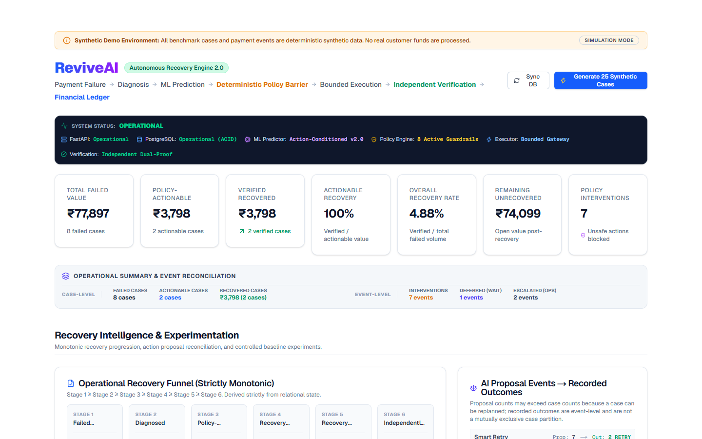
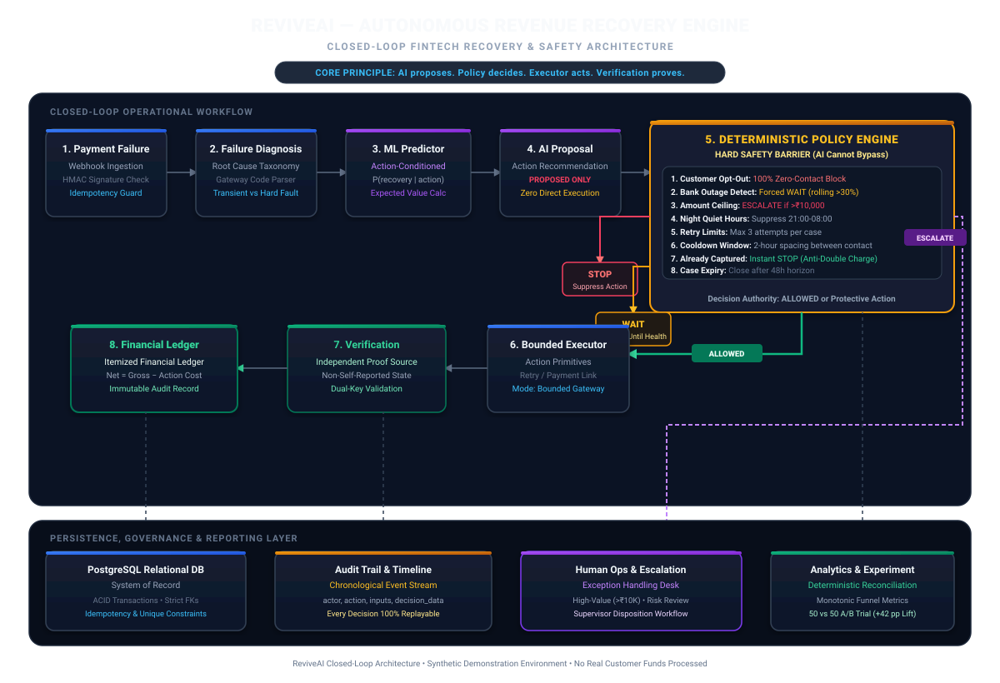
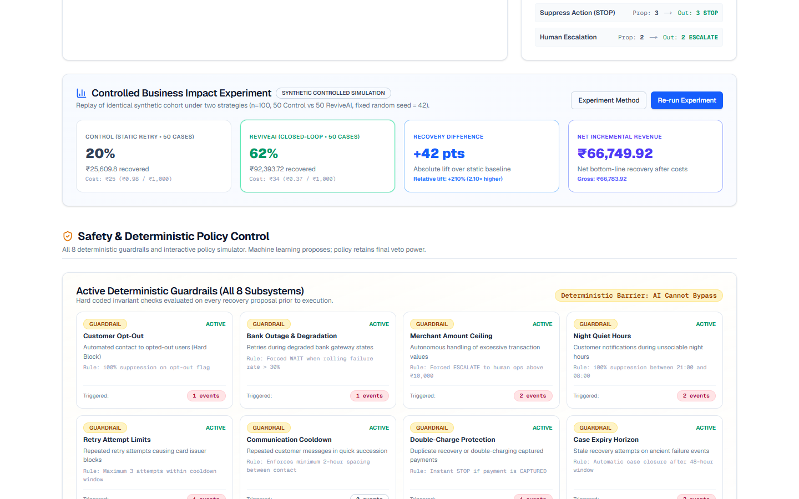
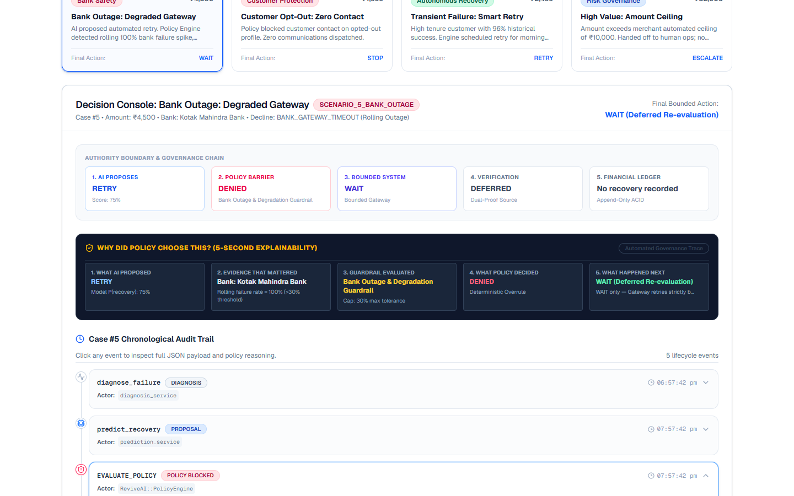
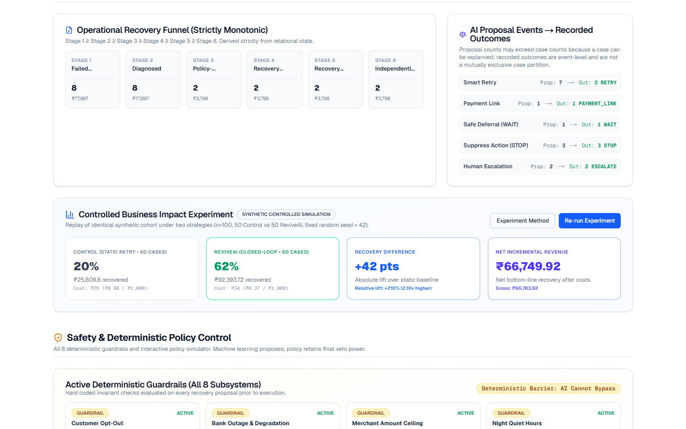

# ReviveAI

Autonomous AI Revenue Recovery Engine

[](https://github.com/krish10a/ReviveAI-Autonomous-AI-Revenue-Recovery-Engine/actions)
[](https://www.python.org/)
[](https://fastapi.tiangolo.com/)
[](https://nextjs.org/)
[](https://docs.pytest.org/)
[](LICENSE)

> **Failed payment → diagnosis → ML prediction → deterministic policy → bounded action → independent verification → financial ledger.**

> **Synthetic Demo Environment**: All payment records, customer profiles, bank degradation events, and recovery transactions in this demonstration repository are synthetic. No real customer funds, live payment credentials, or production merchant accounts are processed.

---

## Visual Showcase

### Command Center & Operational Metrics


### System Architecture


### Interactive Policy Sandbox (Safe Evaluation)


### Decision Replay, Authority Boundary & 5-Second Explainability


### Controlled Business Impact Experiment


---

## Demo in 30 Seconds

Reset the demo environment to its deterministic benchmark state with a single command:

```bash
python scripts/reset_demo.py
```

Then:
1. Open the dashboard at `http://localhost:3000` (or the deployed instance).
2. Select **Bank Outage: Degraded Gateway** (`SCENARIO_5_BANK_OUTAGE`).
3. Observe the authority boundary in real time:
   - **AI proposes**: `RETRY` (Model confidence: 75%)
   - **Policy overrules**: `DENIED` (Bank Outage & Degradation Guardrail detected 100% rolling failure rate > 30% tolerance)
   - **Bounded executor acts**: Commands `WAIT` (No retry storm dispatched to the failing bank)
   - **Independent verification proves**: `DEFERRED` (Confirms zero duplicate charges attempted)
   - **Financial ledger records**: `No recovery recorded` (Zero hallucinated revenue)

---

## What ReviveAI Does

ReviveAI is an autonomous, policy-governed revenue recovery engine designed for recurring payments and failed transaction lifecycles. Instead of naive blind retries that exhaust card limits and incur gateway penalties, or intrusive customer messaging that causes churn, ReviveAI orchestrates a closed-loop recovery workflow:

1. **Failure Diagnosis**: Automatically inspects raw gateway decline codes and maps them to standard failure taxonomy (transient network glitch, insufficient funds, expired card, bank gateway outage, risk block).
2. **Action-Conditioned ML**: Evaluates recovery probabilities across candidate recovery actions ($P(\text{recovery} \mid \text{action})$) using action-conditioned probabilistic models (`ML Predictor: Action-Conditioned v2.0`).
3. **Deterministic Policy Barrier**: Subject every AI proposal to hard business, risk, customer-protection, and operational guardrails (customer opt-out, bank health outage detection, quiet hours, retry caps, and high-value amount ceilings).
4. **Bounded Execution**: Safely dispatches strictly typed, pre-approved action primitives through sandboxed execution runners.
5. **Independent Verification**: Validates payment settlement through independent proof sources—never trusting executor self-reports.
6. **Auditable Financial Ledger**: Writes immutable financial ledger records with itemized action costs and net recovered revenue ($\text{Net} = \text{Gross} - \text{Cost}$).

---

## Core Architecture

```
Payment Failure
       ↓
Failure Diagnosis
       ↓
Action-Conditioned ML Prediction
       ↓
AI Proposal Events
       ↓
DETERMINISTIC POLICY ENGINE
    ↙      ↓      ↘
  STOP   WAIT   ESCALATE  or  ALLOW
    ↓
Bounded Executor
       ↓
Independent Verification
       ↓
Financial Ledger
       ↓
Audit Trail
```

### The Core Architectural Principle
> **AI proposes. Policy decides. Executor acts. Verification proves.**

No machine learning model or LLM agent can directly trigger payment gateway transactions. The deterministic policy engine retains absolute veto authority over all actions.

---

## Why It Is Different

| Capability | Traditional Dunning & Gateway Retries | ReviveAI Closed-Loop Engine |
|---|---|---|
| **Recovery Strategy** | Static retries at arbitrary hours | Action-conditioned ML ($P(\text{recovery} \mid \text{action})$) |
| **Bank Outages** | Repeats retries into failing bank, locking cards | Rolling failure rate monitor forces **`WAIT`** until gateway recovers |
| **Customer Protection** | Continues spamming opted-out customers | Impassable zero-harassment guardrail enforces **`STOP`** |
| **High-Value Risk** | Blindly auto-charges large ticket amounts | Enforces **`ESCALATE`** to human operations above merchant ceiling |
| **Execution Safety** | Open-ended scripts with side-effects | Strictly typed, bounded action enums (`RETRY`, `PAYMENT_LINK`, `WAIT`, `STOP`, `ESCALATE`) |
| **Proof of Settlement** | Assumes executor API success = recovered | Independent verification validates ground-truth capture |
| **Financial Accounting** | Approximate top-line estimates | Immutable append-only ledger tracking Gross, Action Cost, and Net |

---

## Demo Benchmark Metrics

Values derived deterministically from the canonical 8-scenario benchmark walkthrough (`scripts/reset_demo.py`):

* **Total Failed Payment Value**: ₹77,897.00 across 8 failed payment cases
* **Policy-Actionable Value**: ₹3,798.00 (2 cases permitted for autonomous recovery)
* **Verified Revenue Recovered**: ₹3,798.00 (2 independently verified recoveries)
* **Actionable Value Recovery**: 100.0% (Verified recovery / Policy-actionable value)
* **Overall Recovery Rate**: 4.88% (Verified recovery / Total failed payment value)
* **Remaining Unrecovered Value**: ₹74,099.00 (Open value after protective policy stops)
* **Policy Intervention Events**: 7 safety interventions (preventing customer harassment, bank retry storms, and high-value auto-charging)
* **Recovery Action Cost**: ₹2.50 total (₹0.66 per ₹1,000 recovered)
* **Net Revenue Recovered**: ₹3,795.50
* **Operational Summary**: WAIT = 1, ESCALATE = 2 (reconciles with Action Mix)

### Source-of-Truth Invariants
ReviveAI strictly enforces financial accounting and monotonic invariants across the database:
* $\text{Actionable Value} \ge \text{Executed Value} \ge \text{Verified Value}$
* $\text{Actionable Cases} \ge \text{Executed Cases} \ge \text{Verified Cases}$
* Monotonic funnel progression across all 6 stages: Stage 1 ≥ Stage 2 ≥ Stage 3 ≥ Stage 4 ≥ Stage 5 ≥ Stage 6
* WAIT summary == WAIT recorded outcomes
* ESCALATE summary == ESCALATE recorded outcomes
* Verified ledger gross equals analytics revenue recovered

---

## Controlled Simulation Impact

To isolate treatment efficacy, ReviveAI includes a **deterministic controlled simulation** running across an identical synthetic population of failed payments (50 Control vs 50 ReviveAI, fixed seed = 42):

| Metric | Control Group (Static Retry) | ReviveAI (Closed-Loop Pipeline) | Difference / Business Lift |
|---|:---:|:---:|:---:|
| **Sample Size** | 50 cases | 50 cases | Identical cohort |
| **Eligible Revenue** | ₹128,049.00 | ₹149,022.13 | Replay evaluation |
| **Recovery Rate** | **20.0%** | **62.0%** | **+42.0 percentage points** |
| **Relative Improvement** | Baseline | **+210.0% relative lift** | **2.10× recovery rate** |
| **Recovered Revenue** | ₹25,609.80 | ₹92,393.72 | **+₹66,783.92 gross lift** |
| **Action Execution Cost** | ₹25.00 | ₹34.00 | Efficient targeting |
| **Cost per ₹1,000 Recovered** | ₹0.98 | ₹0.37 | **62% lower recovery cost** |
| **Net Incremental Value** | Baseline | **+₹66,749.92** | Pure bottom-line margin |

---

## Safety Model & Guardrail Rules

ReviveAI implements all 8 deterministic policy guardrails in `apps/api/app/services/policy.py`:

1. **Customer Opt-Out**: Immediate hard block (`STOP`). Zero emails, SMS, or payment links dispatched.
2. **Bank Outage & Degradation**: Real-time rolling failure rate analysis across bank gateways. If failure rate > 30%, retries are blocked and system forces **`WAIT`**.
3. **Merchant Amount Ceiling**: Transactions exceeding merchant limit (e.g. ₹10,000) are blocked from automated charging and commanded to **`ESCALATE`** to human operations.
4. **Night Quiet Hours**: Customer contact actions are blocked between 21:00 and 08:00 local merchant time.
5. **Retry Attempt Limits**: Strict cap (maximum 3 retries within cooldown window) to prevent card issuer penalty blocks.
6. **Communication Cooldown**: Minimum 2-hour spacing between customer communications.
7. **Double-Charge Protection**: If payment status is already `CAPTURED`, execution instantly commands `STOP`.
8. **Case Expiry**: Disallows action on cases older than 48 hours.

---

## Tech Stack

* **Backend & API**: Python 3.12, FastAPI, Pydantic v2, Uvicorn
* **Database & ORM**: PostgreSQL (SQLite supported for local CI), SQLAlchemy 2.0, Alembic
* **Machine Learning**: Scikit-learn (`CalibratedClassifierCV`, `LogisticRegression`), NumPy, Pandas
* **Frontend Dashboard**: Next.js 16 (App Router, Turbopack), React 19, TypeScript, Tailwind CSS, Lucide Icons
* **Testing & CI**: Pytest, Pytest-Asyncio, HTTPX, GitHub Actions CI
* **Payments Integration**: Razorpay API webhook ingestion with HMAC SHA-256 validation

---

## Project Structure

```
revive-ai/
├── .github/
│   └── workflows/
│       └── ci.yml               # GitHub Actions CI (Backend tests + Frontend build)
├── apps/
│   ├── api/                     # FastAPI Backend Application
│   │   ├── app/
│   │   │   ├── models/          # SQLAlchemy ORM Models (Payment, RecoveryCase, RecoveryLedger)
│   │   │   ├── routers/         # Webhook, Recovery, Analytics, Timeline, Simulation
│   │   │   ├── schemas/         # Pydantic Request/Response Models
│   │   │   ├── services/        # PolicyEngine, Executor, Verification, Prediction, Analytics
│   │   │   └── main.py          # FastAPI Application Entrypoint & Health Endpoints
│   │   └── requirements.txt     # Python Dependencies
│   └── web/                     # Next.js 16 Web Dashboard
│       └── src/
│           ├── app/             # Next.js App Router Pages
│           └── components/      # Dashboard, AuditTimeline, DecisionExplainer, MetricCard
├── database/
│   ├── alembic/                 # Database Migrations
│   └── seed/                    # Deterministic Demo Seeding (8 canonical scenarios)
├── docs/
│   ├── architecture.svg         # Clean SVG Architecture Diagram (vector-rendered)
│   ├── screenshots/             # Real Application Screenshots
│   │   ├── dashboard.png        # Command Center & KPIs
│   │   ├── policy-lab.png       # Policy Lab Sandbox
│   │   ├── decision-replay.png  # Decision Console & 5-Second Explainability
│   │   └── experiment.png       # Controlled Simulation Impact
│   ├── architecture.md          # Architectural Technical Specification
│   ├── demo.md                  # Demo & Reproducibility Guide
│   ├── demo_script.md           # 5-Minute Judge Presentation Script
│   └── evaluation.md            # ML Model Evaluation & Calibration Report
├── ml/
│   ├── datasets/                # Action-Conditioned Dataset Generator
│   ├── features/                # ColumnTransformer & Feature Extraction
│   ├── training/                # Model Training Script
│   ├── evaluation/              # Model Evaluation Results & Calibration Bins
│   └── models/                  # Calibrated Model Pickles & Metadata
├── scripts/
│   └── reset_demo.py            # Single-command deterministic demo reset & verifier
├── simulations/
│   ├── reset_demo.py            # Environment initialization
│   └── run_winning_demo.py      # 8-Scenario Canonical Recovery Pipeline Runner
├── tests/                       # Automated Pytest Suite (Invariants, Policy, ML, Webhook, HTTP)
├── Makefile                     # Root developer make targets (make demo, make test, make build)
└── README.md                    # Project Engineering Showcase
```

---

## Getting Started

### 1. Prerequisites
* Python 3.10 – 3.12
* Node.js 18+ and npm
* PostgreSQL (or SQLite local fallback)

### 2. Setup
```bash
# Clone the repository
git clone https://github.com/krish10a/ReviveAI-Autonomous-AI-Revenue-Recovery-Engine.git
cd ReviveAI-Autonomous-AI-Revenue-Recovery-Engine

# Setup environment variables
cp .env.example .env

# Install backend dependencies
pip install -r apps/api/requirements.txt

# Install frontend dependencies
cd apps/web && npm install && cd ../..
```

### 3. Reset Demo Environment (Deterministic Known State)
```bash
# Single command: Cleans DB, seeds canonical scenarios, runs winning demo pipeline, verifies invariants
python scripts/reset_demo.py
# Or using make:
make demo
```

### 4. Run Development Servers
```bash
# Terminal 1: Backend API (FastAPI)
cd apps/api && uvicorn app.main:app --reload --port 8000

# Terminal 2: Frontend Dashboard (Next.js)
cd apps/web && npm run dev
```

Open [http://localhost:3000](http://localhost:3000) in your browser.

---

## Testing

Run the automated test suite:

```bash
pytest tests/ -v
# Or using make:
make test
```

Build the production web frontend:
```bash
cd apps/web && npm run build
# Or using make:
make build
```

---

## Documented API Endpoints

### System & Health
* `GET /health` — Basic service liveness check
* `GET /health/db` — Database connection check (`SELECT 1`)
* `GET /health/system` — Comprehensive operational health check across API, Database, ML model, Policy Engine, Executor, and Verification

### Analytics & Reporting
* `GET /analytics/overview` — Live operational overview, monotonic funnel metrics, reconciled action mix, and active guardrail states
* `GET /analytics/failure-reason` — Empirical recovery breakdown by failure code taxonomy
* `GET /analytics/intervention-performance` — Performance metrics by recovery intervention type
* `POST /analytics/experiment` — Deterministic controlled simulation: Control vs. AI cohort (n=100, seed=42)

### Recovery Cases & Decision Replay
* `GET /recovery-cases` — List recovery cases with pagination
* `GET /recovery-cases/{id}` — Retrieve recovery case detail
* `GET /recovery-cases/{id}/timeline` — Retrieve chronological audit events for case replay
* `POST /recovery/policy-lab/simulate` — Interactive Policy Lab sandbox (test amount ceiling, bank outages, opt-out without financial execution)

### Ingestion & Simulation
* `POST /api/webhook/razorpay` — Ingest raw payment gateway failure events with HMAC SHA-256 signature verification
* `POST /api/simulate/batch` — Generate synthetic operational cases through the full closed-loop pipeline

---

## Synthetic Data Disclosure

> **Synthetic Demo Environment**: All payment records, customer profiles, bank degradation events, and recovery transactions in this demonstration repository are synthetic. No real customer funds, live payment credentials, or production merchant accounts are processed.
